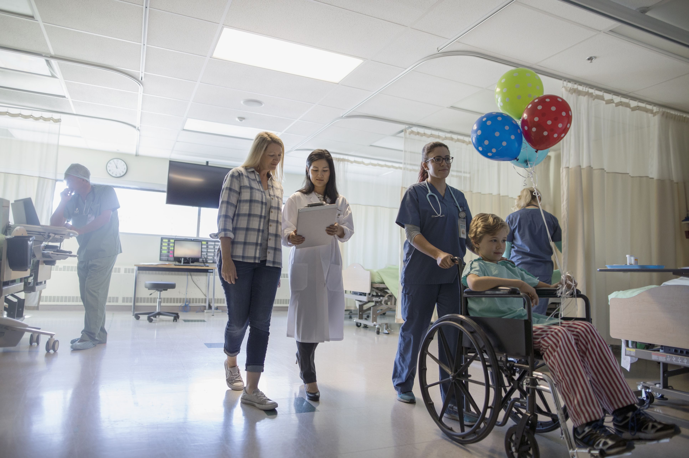

---
title: "Risk Factors for Non-Routine Discharge in Cerebral Palsy Patients Undergoing Spinal Fusion"
output: html_document
---



# Table of Contents

* <a href="#intro">Introduction</a>
* <a href="#characterize">Data Characterization</a>
* <a href="#tidying">Tidying The Data</a>
* <a href="#explore">Data Exploration</a>
* <a href="#model">Modeling Discharge Status</a>
* <a href="#discuss">Discussion</a>
* <a href="#refs">References</a>

---

### Authors

* Katherine Dimitropoulou PhD (UNI: kd2524)
* Jerri Chen MD, PhD (UNI: jc4166)
* Lisa Eisler MD (UNI: ldl2113)

<h1 id="intro">Introduction</h1>

## Project Motivation and Literature Review

Children with cerebral palsy (CP) often present with a curvature of the spine, or scoliosis, as a result of abnormal muscle tone and postural weakness.<sup>[1](https://www.flintrehab.com/2019/cerebral-palsy-scoliosis/)</sup> The clinical characteristics of scoliosis in CP patients involve a deformity of the lumbar and thoracic spine often accompanied by pelvic torque and postural problems, which leads to loss of function and pain. Severe spinal curves (>50 degrees) are difficult to control with braces, especially if they are rapidly growing. Surgical treatment is often the recommended intervention to prevent further deterioration of functional mobility, and improve quality of life.

The surgical treatment of individuals with CP who present with severe neuromuscular scoliosis has been associated with peri- and postoperative complication rates as high as 75%. Mohamad et al. (2007) carried out a retrospective record review of 175 patients with neuromuscular scoliosis, with 73.7 % of them being patients with CP.<sup>[2](https://www.ncbi.nlm.nih.gov/pubmed/17513958/)</sup> The peri- and post-operative complications rate was 33.1 % (58/175). Patients experienced a combination of pulmonary complications (~20%), infections (8%), neurological (4%), and cardiovascular problems (4%). In another retrospective study, Tsirikos et al. (2008) reported data in 287 patients with CP who underwent spinal fusion.<sup>[3](https://www.ncbi.nlm.nih.gov/pubmed/18449049/)</sup> They reported major complications including 3 perioperative deaths, an intraoperative complication rate of 10.8 % (38/287), an early postoperative (within 6 weeks) complication rate of 9.4 % (27/287), and a late postoperative complication rate of 10.1 % (29/ 287). Lastly, a prospective cohort study with 127 patients with CP (Samdani, et.al. 2016) reported an overall 39.4% of  major perioperative complications that resulted in increased hospitalization length, use of intensive care unit, and readmission. The authors reported perioperative risk variables such as increase of blood loss, staged procedures and the lack of antifibrinolytic use.<sup>[4](https://www.ncbi.nlm.nih.gov/pubmed/26148567/)</sup> They also reported some pre-operative indicators such as the larger preoperative kyphosis, lower body mass index (BMI) as risk factors for complications.

In all studies, there appear to be pre- and/or peri-operative risk factors associated with increased complications, but no study has comprehensively examined these factors. In addition, no study has examined non-routine discharge, with discharge to home (or home facility) assumed to be the routine as well as preferred outcome from a rehabilitation standpoint. We believe that patients and their families benefit from reasonable expectations about the chance of a decline in function, higher-level care needs or even death in the initial 30-day postoperative period. A model predicting non-routine discharge (defined as discharge to a higher level of care including postoperative death) may aid in patient selection and family decision making. We consider the outcome of non-home discharge in particular to be an indicator that spinal fusion surgery has failed to improve quality of life or funcitonal status, at least in the short term and perhaps permanently.

Our team comprises anesthesiologists and rehabilitation therapists who often care for patients with CP. We can combine expertise to develop behavioral and biological intervention protocols, and to make decisions regarding the proper timing and optimization for surgery. 


<h1 id="characterize">Data Characterization</h1>

```{r setup, echo=FALSE, message=FALSE, warning=FALSE}
library(tidyverse)
library(haven)
library(plotly)
library(viridis)
library(data.table)
library(formattable)
library(readxl)
library(patchwork)
library(data.table)
library(tableone)

# Formatting plot output
knitr::opts_chunk$set(
  out.width = "90%"
  )
# Set the plot design
theme_set(theme_classic() + 
            theme(legend.position = "bottom", 
                  legend.key.size = unit(1.5, "line"),
                  plot.title = element_text(hjust = 0.5)))
# Raw data
nsqipspineCP_1617 = read_csv("./data/nsqipspineCP_1617.csv")
```

In its raw form, the data has `r nrow(nsqipspineCP_1617)` rows and `r ncol(nsqipspineCP_1617)` columns. Each row corresponds to a single spinal fusion and 384 demographic, medical, surgical, and pre/intra/postoperative characteristics and events, which required a massive amount of chart review by a clinical reviewer.

A copy of the data could not be shared due to licensing agreements.

This is a focused analysis, interested only in a handful of important postoperative outcomes as they relate to the recovery of CP patients undergoing spinal fusion. These variables are defined here:

```{r, echo=FALSE, message=FALSE, warning=FALSE}
variables = read_excel("data/CPSpineVariables.xlsx")

variables[is.na(variables)] <- ""

formattable(variables, 
            align = c("l","l","l"), 
            list(`Data Category` = formatter(
              "span", 
              style = ~ style(color = "grey",font.weight = "bold"))))

```

Therefore we will tidy the data to that end.

<h1 id="tidying">Tidying the Data</h1>

## Data Reduction & Cleaning

To start the cleaning, we replaced the value "-99" with NA to indicate non-zero missingness. We converted age in days to age in years and height and weight to the metric system. We then created a BMI estimate based on height and weight. American Society of Anesthesiologists Physical Status Classification (ASA Class) was converted from a character variable to a factor variable. Extent of surgical fusion (inflection point 13 levels) was used to create a dichotomous variable, level_13. A dichotomous variable indicating whether the patient returned home or was discharged to a facility was created and null values deleted. A subset of the data was selected for analysis.

```{r, message=FALSE, warning=FALSE}
cp_spine_tidy = nsqipspineCP_1617 %>%
  mutate_if(is.numeric, ~replace(., . == -99, NA)) %>%
  mutate(
    age_years = age_days/365.25,
    height = height*2.54,
    weight = weight/2.2) %>%
  mutate(
    bmi = weight/((height/100)*(height/100)),
    asa_status = case_when(
      asaclas == "ASA 1 - No Disturb" ~ "1",
      asaclas == "ASA 2 - Mild Disturb" ~ "2",
      asaclas == "ASA 3 - Severe Disturb" ~ "3",
      asaclas == "ASA 4 - Life Threat" ~ "4",
      asaclas == "None assigned" ~ "NA"),
    home_discharge = case_when(
      dischdest == "Expired" ~ "FALSE",
      dischdest == "Facility Which was Home" ~ "TRUE",
      dischdest == "Home" ~ "TRUE",
      dischdest == "Rehab" ~ "FALSE",
      dischdest == "Separate Acute Care" ~ "FALSE",
      dischdest == "Skilled Care, Not Home" ~ "FALSE",
      dischdest == "Unknown" ~ "NA",
      dischdest == "Unskilled Facility Not Home" ~ "FALSE",
      dischdest == "NULL" ~ "NA"),
    level_13 = case_when(
      prncptx == "ARTHRODESIS, ANTERIOR, FOR SPINAL DEFORMITY, WITH OR WITHOUT CAST; 2 TO 3 VERTEBRAL SEGMENTS" ~ "FALSE",
      prncptx == "ARTHRODESIS, ANTERIOR, FOR SPINAL DEFORMITY, WITH OR WITHOUT CAST; 4 TO 7 VERTEBRAL SEGMENTS" ~ "FALSE",
      prncptx == "ARTHRODESIS, ANTERIOR, FOR SPINAL DEFORMITY, WITH OR WITHOUT CAST; 8 OR MORE VERTEBRAL SEGMENTS" ~ "FALSE",
      prncptx == "ARTHRODESIS, POSTERIOR, FOR SPINAL DEFORMITY, WITH OR WITHOUT CAST; UP TO 6 VERTEBRAL SEGMENTS" ~ "FALSE",
      prncptx == "ARTHRODESIS, POSTERIOR, FOR SPINAL DEFORMITY, WITH OR WITHOUT CAST; 7 TO 12 VERTEBRAL SEGMENTS" ~ "FALSE",
      prncptx == "ARTHRODESIS, POSTERIOR, FOR SPINAL DEFORMITY, WITH OR WITHOUT CAST; 13 OR MORE VERTEBRAL SEGMENTS" ~ "TRUE")) %>%
  filter(home_discharge != "NA") %>% 
  select(pufyear_x:ped_spn_post_neurodeftype, age_years, sex, height, weight, bmi, ethnicity_hispanic, race, asa_status, transt, ventilat, asthma, hxcld, oxygen_sup, crf, impcogstat, seizure, nutr_support, hemodisorder, level_13, optime, tothlos, d_opto_dis, death30yn, supinfec, wndinfd, orgspcssi, dehis, oupneumo, pulembol, renainsf, urninfec, cszre, neurodef, cdarrest, othbleed, bleed_ml_tot, othcdiff, othsysep, unplannedreadmission1, reoperation, dischdest, home_discharge)
```

After data cleaning, we had a dataset with 822 observations and 57 variables total.


<h1 id="explore">Data Exploration</h1>

## Descriptive Analyses

To give a sense of the overall demographic and medical characteristics of our cohort, continuous and categorical variables considered to be predictors or covariates impacting adverse outcomes are included in the following table, as mean(SD) or n(%).

```{r, message=FALSE, warning=FALSE}
cp_spine_table1 = cp_spine_tidy %>%
mutate(
    sex = factor(sex, ordered = TRUE, levels = c("Female", "Male")),
    race = factor(race, ordered = FALSE, levels = c("American Indian or Alaska Native", "Asian", "Black or African American", "Native Hawaiian or Other Pacific Islander", "Unknown/Not Reported", "White")),
    admit_from = factor(transt, ordered = TRUE, levels = c("Admitted from home/clinic/doctor's office", "Admitted through ER including outside ER with direct hospital admission", "Chronic care/Rehab/Intermediate Care/Spinal Cord", "Transferred from outside hospital (NICU, PICU, Inpatient on General floor, Adult)", "Other")),
    ASAstatus = factor(asa_status, ordered = TRUE, levels = c("1", "2", "3", "4", "5")),
    ventilator_dependence = factor(ventilat, ordered = TRUE, levels = c("No", "Yes")),
    asthma = factor(asthma, ordered = TRUE, levels = c("No", "Yes")),
    home_oxygen = factor(oxygen_sup, ordered = TRUE, levels = c("No", "Yes")),
    cognitive_impairment = factor(impcogstat, ordered = TRUE, levels = c("No", "Yes")),
    seizure_disorder = factor(seizure, ordered = TRUE, levels = c("No", "Yes")),
    nutritional_support = factor(nutr_support, ordered = TRUE, levels = c("No", "Yes")),
    hematologic_disorder = factor(hemodisorder, ordered = TRUE, levels = c("No", "Yes"))
)
myVars <- c("age_years", "sex", "height", "weight", "ASAstatus", "admit_from", "ventilator_dependence", "asthma", "home_oxygen", "cognitive_impairment", "seizure_disorder", "nutritional_support", "hematologic_disorder")
catVars <- c("sex", "ASAstatus", "admit_from", "ventilator_dependence", "asthma", "home_oxygen", "cognitive_impairment", "seizure_disorder", "nutritional_support", "hematologic_disorder")
tab3 <- CreateTableOne(vars = myVars, data = cp_spine_table1, factorVars = catVars)
```

```{r, message=FALSE, warning=FALSE}
tab3df = print(tab3)
```


From this table, we can appreciate that this is not a healthy population. The majority of our patients were American Society of Anesthesiologists (ASA) Physical Status 3-4, indicating that their anesthesiologist felt that they suffered severe systemic disease, with substantive functional limitations. 97% of patients were being cared for at home preoperatively, and 10% were ventilator dependent. 91% were cognitively impaired, with ~50% requiring nutritional support.

Next, to give a sense of the frequency of adverse events in our overall cohort, categorical outcome variables are included in the following table, as n(%).

```{r, message=FALSE, warning=FALSE}
cp_spine_table2 = cp_spine_tidy %>%
mutate(
    urinary_tract_infection = factor(urninfec, ordered = TRUE, levels = c("No Complication","Urinary Tract Infection")),
    wound_infection = factor(wndinfd, ordered = FALSE, levels = c("No Complication", "Deep Incisional SSI")),
    home_discharge = factor(home_discharge, ordered = TRUE, levels = c("TRUE", "FALSE")),
    reoperation = factor(reoperation, levels = c("No", "Yes")),
    death_in_30_days = factor(death30yn, ordered = TRUE, levels = c("No", "Yes"))
)
myVars <- c("urinary_tract_infection", "wound_infection", "home_discharge", "reoperation", "death_in_30_days")
catVars <- c("urinary_tract_infection", "wound_infection", "home_discharge", "reoperation", "death_in_30_days")
tab4 <- CreateTableOne(vars = myVars, data = cp_spine_table2, factorVars = catVars)
```

```{r, message=FALSE, warning=FALSE}
tab4df = print(tab4)
```

The most common major adverse outcome was non-home discharge, impacting 6.4% (n=53) of patients. Given the frequency of non-home discharge and our clinical interests in preventing adverse peri-operative outcomes and in rehabilitation of children with CP, we decided to focus our analysis on this outcome. 

The following plot shows similar numbers of male and female patients who had home vs. non-home discharge.
```{r, message=FALSE, warning=FALSE}
cp_spine_tidy %>%
  group_by(home_discharge) %>% 
  count(sex) %>% 
  plot_ly(
    x = ~home_discharge, y = ~n, color = ~sex, type = "bar"
    ) %>% 
  layout(
    xaxis = list(title = "Home Discharge"),
    yaxis = list(title = "Number of Patients"))
```

The distribution of ages for patients with non-home discharge trends higher than patients with home discharge.
```{r, message=FALSE, warning=FALSE}
cp_spine_tidy %>%
  plot_ly(y = ~age_years, color = ~home_discharge, type = "box",
          colors = "Set2") %>% 
  layout(
    xaxis = list(title = "Home Discharge"),
    yaxis = list(title = "Age (Years)"))
```

The following plots show the percent of patients with non-home discharge, stratified by race or ethnicity.
```{r, message=FALSE, warning=FALSE}
cp_spine_tidy %>%
  group_by(home_discharge) %>% 
  count(race) %>% 
  pivot_wider(
    names_from = "home_discharge",
    values_from = "n"
  ) %>% 
  janitor::clean_names() %>% 
  mutate(percent_nothome = (false/(true + false))*100) %>% 
  replace(is.na(.), 0) %>% 
  plot_ly(
    x = ~race, y = ~percent_nothome, type = "bar"
    ) %>% 
  layout(
    xaxis = list(title = "Race"),
    yaxis = list(title = "Percent Non-Home Discharge"))
```

```{r, message=FALSE, warning=FALSE}
cp_spine_tidy %>%
  group_by(home_discharge) %>% 
  count(ethnicity_hispanic) %>% 
  rename(ethnicity = ethnicity_hispanic) %>% 
  mutate(ethnicity = case_when(
    ethnicity == "No" ~ "Non-Hispanic",
    ethnicity == "Yes" ~ "Hispanic",
    ethnicity == "NULL" ~ "Other/Did Not Answer"
  )) %>% 
    pivot_wider(
    names_from = "home_discharge",
    values_from = "n"
  ) %>% 
  janitor::clean_names() %>% 
  mutate(percent_nothome = (false/(true + false))*100) %>% 
  replace(is.na(.), 0) %>% 
  plot_ly(
    x = ~ethnicity, y = ~percent_nothome, type = "bar"
    ) %>% 
  layout(
    xaxis = list(title = "Ethnicity"),
    yaxis = list(title = "Percent Non-Home Discharge"))
```
Because of the large "Other/Did Not Answer" group, it is difficult to interpret the contribution of ethnicity as a risk factor for non-home discharge.

While we focused on the home discharge outcome, during exploratory analysis, we did attempt to see if there were any other interesting relationships between potential risk factors and outcomes. For example:

### Age and Operation Time
```{r, message=FALSE, warning=FALSE}
cp_spine_tidy %>%
  plot_ly(
    x = ~age_years, y = ~optime, type = "scatter", mode = "markers", alpha = 0.5)  %>% 
  layout(
    xaxis = list(title = "Age (Years)"),
    yaxis = list(title = "Length of Operation (Minutes)"))
```

### Operation Time and Bleeding
```{r, message=FALSE, warning=FALSE}
cp_spine_tidy %>%
  plot_ly(
    x = ~optime, y = ~bleed_ml_tot, type = "scatter", mode = "markers", alpha = 0.5)  %>% 
  layout(
    xaxis = list(title = "Length of Operation (Minutes)"),
    yaxis = list(title = "Blood Loss (mL)"))
```

### Bleeding and Length of Stay
```{r, message=FALSE, warning=FALSE}
cp_spine_tidy %>%
  plot_ly(
    x = ~bleed_ml_tot, y = ~tothlos, type = "scatter", mode = "markers", alpha = 0.5)  %>% 
  layout(
    xaxis = list(title = "Blood Loss (mL)"),
    yaxis = list(title = "Length of Stay (Days)"))
```

There were no clear relationships between single predictors and outcomes, which lead us to attempt to build a model that incorporates multiple predictors for our outcome of interest.

<h1 id="model">Modeling Discharge Status</h1>

Given the sample size (small) our analysis goal is to develop a model of possible assosiations between pre-surgical indicators and the outcome. We use crosstabs and chisquare tests to examine associations between each of the indicators and the outcome (Preliminary analysis) and logistic regression to build our models.

Data processing, elimination of missing data, and data selection for the analysis. 
```{r, message=FALSE, warning=FALSE}
model_data = cp_spine_tidy %>% 
  mutate(
    sex1=case_when(
    sex=="Male"~"0",
    sex=="Female"~"1"),
    sex1=as.factor(sex1),
    race = case_when(
    race == "American Indian,Alaskan Native" ~ "1",
    race == "Asian" ~ "2",
    race == "Black or African American" ~ "3",
    race == "Native Hawaiian or Other Pacific Islander" ~ "4",
    race == "White" ~ "5",
    race == "Unknown Not Reported" ~ "6"),
    race1=as.factor(race),
    asa_level = ifelse(asa_status >2, 1, 0),
    asa_level=as.factor(asa_level),
    ventilat1=case_when(
    ventilat=="No"~"0",
    ventilat=="Yes"~"1"),
    ventilat1=as.factor(ventilat1), 
  asthma1=case_when(
    asthma=="No"~"0",
    asthma=="Yes"~"1"),
  asthma1=as.factor(asthma1),
  hxcld1=case_when(
    hxcld=="No"~"0",
    hxcld=="Yes"~"1"),
  hxcld1=as.factor(hxcld1),
  oxygen_sup1=case_when(
    oxygen_sup=="No"~"0",
    oxygen_sup=="Yes"~"1"),
  oxygen_sup1=as.factor(oxygen_sup1),
  seizure1=case_when(
    seizure=="No"~"0",
    seizure=="Yes"~"1"),
  seizure1=as.factor(seizure1),
  nutr_support1=case_when(
    nutr_support=="No"~"0",
    nutr_support=="Yes"~"1"),
  nutr_support1=as.factor(nutr_support1),
hemodisorder1=case_when(
    hemodisorder=="No"~"0",
    hemodisorder=="Yes"~"1"),
  hemodisorder1=as.factor(hemodisorder1),
impcogstat1=case_when(
    impcogstat=="No"~"0",
    impcogstat=="Yes"~"1"),
  impcogstat1=as.factor(impcogstat),
 level_13=as.factor(level_13),
 home_discharge1=case_when(
   home_discharge=="TRUE"~"1",
   home_discharge=="FALSE"~"0"),
home_discharge1=as.factor(home_discharge1), 
  crf1 = case_when(
      crf == "Major cardiac risk factors" ~ "TRUE",
      crf == "Severe cardiac risk factors" ~"TRUE",
      crf == "Minor cardiac risk factors" ~ "FALSE",
      crf == "No cardiac risk factors" ~ "FALSE"), 
  crf1=as.factor(crf1),
  transt1 = case_when(
      transt == "Chronic care Rehab/Intermediate Care/Spinal Cord" ~ "FALSE",
      transt == "Transferred from outside hospital (NICU, PICU, Inpatient on General floor, Adult" ~"FALSE",
      transt == "other" ~ "FALSE",
      transt == "Admitted from home/clinic/doctor's office" ~ "TRUE",
      transt == "Admitted through ER, including outside ER with direct hospital admission" ~ "TRUE"),
  transt1=as.factor(transt1))%>%
  select(age_years, bmi, weight, height, sex1, transt1, crf1, race1, asa_level, ventilat1, asthma1,impcogstat1, hxcld1, oxygen_sup1, seizure1, nutr_support1, hemodisorder1, level_13, home_discharge1) 
```

## Preliminary Analysis
Two-way contingency tables of categorical outcome and predictors identified. Ensure that there no cells with counts <=5 and compute Chi-square tests to examine the association of each of the indicators to the outcome. 

## Sex
```{r, message=FALSE, warning=FALSE}
xtabs(~ home_discharge1+ sex1, data = model_data)
```
no cells with counts<=5

```{r, message=FALSE, warning=FALSE}
tbl<-xtabs(~ home_discharge1+ sex1, data = model_data)
chisq.test(tbl) 
```
Chi-square test reveals no association between Sex and Home_discharge (p>.05).

## Race
```{r, message=FALSE, warning=FALSE}
xtabs(~ home_discharge1+ race1, data = model_data)
```
Race cross tab with home_dicharge1 has 1 cell with 0 data point and two more cells with 15 and bellow data points. Thus race will be excluded from the model. 

## ASA Classification (ASA_level)
```{r, message=FALSE, warning=FALSE}
xtabs(~ home_discharge1+ asa_level, data = model_data)
```
Asa_level has a cell with 2 data points we  need to take out from the model (unstable model.

## Ventilator Dependence (Ventilat1)
```{r, message=FALSE, warning=FALSE}
xtabs(~ home_discharge1+ ventilat1, data = model_data)
```
Cell with less than 5 data points may consider to take out (unstable model)

## Asthma1
```{r, message=FALSE, warning=FALSE}
xtabs(~ home_discharge1+ asthma1, data = model_data)
```
no cells with counts<=5
```{r, message=FALSE, warning=FALSE}
tbl<-xtabs(~ home_discharge1+ asthma1, data = model_data)
chisq.test(tbl) 
```
Chi-square test reveals no association between Asthma1 and Home_discharge (p>.05).

## Chronic lung disease (hxcld1)
```{r, message=FALSE, warning=FALSE}
xtabs(~ home_discharge1+ hxcld1, data = model_data)
```
no cells with counts<=5

```{r, message=FALSE, warning=FALSE}
tbl<-xtabs(~ home_discharge1+ hxcld1, data = model_data)
chisq.test(tbl) 
```
Chi-square test reveals no association between hxcld1 and Home_discharge (p>.05).

## Oxygen support (oxygen_sup1)
```{r, message=FALSE, warning=FALSE}
xtabs(~ home_discharge1+ oxygen_sup1, data = model_data)
```
we have a cell with only 3 counts, will not include.

## Seizures
```{r, message=FALSE, warning=FALSE}
xtabs(~ home_discharge1+ seizure1, data = model_data)
```
no cells with counts<=5

```{r, message=FALSE, warning=FALSE}
tbl<-xtabs(~ home_discharge1+ seizure1, data = model_data)
chisq.test(tbl) 
```
Chi-square test reveals no association between seizure1 and Home_discharge (p>.05).

## Nutrition support (nutr_support1)
```{r, message=FALSE, warning=FALSE}
xtabs(~ home_discharge1+ nutr_support1, data = model_data)
```
no cells with counts<=5

```{r, message=FALSE, warning=FALSE}
tbl<-xtabs(~ home_discharge1+ nutr_support1, data = model_data)
chisq.test(tbl) 
```
Chi-square test reveals no association between nutr_support1 and Home_discharge (p>.05).

# Pre-existing hemotological disorder (hemodisorder1)
```{r, message=FALSE, warning=FALSE}
xtabs(~ home_discharge1+ hemodisorder1, data = model_data)
```
no cells with counts<=5

```{r, message=FALSE, warning=FALSE}
tbl<-xtabs(~ home_discharge1+ hemodisorder1, data = model_data)
chisq.test(tbl) 
```
Chi-square test reveals a significant association between hemodisorder1 and Home_discharge (p<.05).

## Cardiac Risk Factor (crf1)
```{r, message=FALSE, warning=FALSE}
xtabs(~ home_discharge1+ crf1, data = model_data)
```
no cells with counts<=5

```{r, message=FALSE, warning=FALSE}
tbl<-xtabs(~ home_discharge1+ crf1, data = model_data)
chisq.test(tbl) 
```
Chi-square test reveals no significant association between crf1 and Home_discharge (p>.05).

## Spine fusion level_13
```{r, message=FALSE, warning=FALSE}
xtabs(~ home_discharge1+ level_13, data = model_data)
```
no cells with counts<=5

```{r, message=FALSE, warning=FALSE}
tbl<-xtabs(~ home_discharge1+ level_13, data = model_data)
chisq.test(tbl) 
```
Chi-square test reveals no significant association between crf1 and Home_discharge (p>.05).

## Selection of variables for the Full Model
Initially there were 18 pre-operative indicators to be considered for the main outcome `home_discharge` To select the variables for our full model we used the following criteria:

1) From groups of variables that were highly correlated with each other, we selected one variable that was supported from the literature. For example, we used weight instead of height and bmi, as height is a non reliable measure for individuals with CP and has a lot of missing values in the dataset. 

2) From the preliminary analysis (crosstabs) we identified and eliminated variables that presented with cell counts <=5. Thus, `race`, `asa_level1`, `ventilat1` and `oxygen_sup1` were not included in the model

3) We finally eliminated variables such as `ethnicity` because there was a large number of patients who self-identified as "Other" and it is unclear how to use "Other" to create preditions. 

Therefore, our full regression model consisted of 10 variables. 
## Logistic Regression Models
Full Model
```{r, message=FALSE, warning=FALSE}
mylogit <- glm(home_discharge1 ~ age_years+ weight+ sex1 + crf1+asthma1 +impcogstat1+ hxcld1+ seizure1 + nutr_support1 + hemodisorder1+ level_13, data = model_data, family = "binomial")
summary(mylogit)
```
Age and pre-existing hematological disorder were significant at a=0.05. We further examined ways to improve our model fit. Given the small sample size some variables known to the literature as predictors for complications in patients (not patients with CP) who undergo spinal fusion may have not been able to be identified. For example `asthma1`, `hxcld1`, `nutr_support1` and `level_13`, are variables that have been associated with negative outocmes. Thus, we can run a reduced model with these  3 variables as well as `age_years` and `hemodisorder1` .

Reduced model has 6 indicators
```{r, message=FALSE, warning=FALSE}
mylogit <- glm(home_discharge1 ~ age_years+ asthma1+ hxcld1 + nutr_support1 + hemodisorder1+ level_13, data = model_data, family = "binomial")
summary(mylogit)
```
The model appears to fit better the data than the full model. We observe the distribution of the deviance residuals for individual cases used in the model. Compared to the full model the reduced model appears to fits better. AIC is also better (lower). Age  and the pre existence of hematologic disorder remain  significant at a=.05.

We use the null and deviance residuals 
```{r, message=FALSE, warning=FALSE}
with(mylogit, null.deviance - deviance)
```
with Df

```{r, message=FALSE, warning=FALSE}
with(mylogit, df.null - df.residual)
```
We compute the Chi-Square test

```{r, message=FALSE, warning=FALSE}
with(mylogit, pchisq(null.deviance - deviance, df.null - df.residual, lower.tail = FALSE))
```
The chi-square provides a p-value=0.00192 (p< 0.05), thus, our reduced model as a whole fits significantly better than the null model. 

We can use the likelihood ratio test (-2*log likelihood) to see the model’s log likelihood:
```{r, message=FALSE, warning=FALSE}
logLik(mylogit)
```
## Preliminary intrepretation for the betas 
Two predictors in the model came up significant at a=.05.
1. For every 1 year increase in age the log odds of homedischarge (versus discharge to other healthcare facilities) decreases by 0.19.
2. Having a pre-existing hematologic disorder decreases the log odds of being discharged to home by 1.29.
Surprisingly, we have not seen a significant impact of any of the comorbities or the severity of the scoliosis on the primary outcome. 

Confidence intervals for the log odds coeficients (log-likelihood function)
```{r, message=FALSE, warning=FALSE}
confint(mylogit)
```
Confidence intervals using the standard errors
```{r, message=FALSE, warning=FALSE}
confint.default(mylogit)
```
Exponantiate to odds ratios and Confidence intervals
```{r, message=FALSE, warning=FALSE}
exp(cbind(OR = coef(mylogit), confint(mylogit)))
```
## Odds ratios interpretation
For every year increase in age the odds of being released to a health care facility (not home) increase by (1/.82=1.22) by 22% (all other variables remain constant).
The odds of being discharged at home if you have a pre-existing hematological disorder are 0.28.This means that if the patient with CP has a pre-existing hematologic disorder the odds of being discharged to a health care facility are (1/.27=3.7) 3.7 the odds of being discharged to home (all other variables remain constant). 
Other co-morbidity variables
Important pre-operative indicators that have been identified for other patients who undergo spinal fusion surgery, such as asthma, chronic lung disease, need for nutritional support and severity of the scoliosis do not appear to have a direct impact on the outcome for individuals with CP. When we exponantiate the betas for asthma, chronic lung disease, need for nutritional support and severity of the scoliosis, we observe the following odds ratios: 
For patients with CP who have asthma the odds to develop complications and to be released to a health care facility (not home) increase by (1/.82=1.44) by 44%. 
For patients with CP who have nutritional support the odds to develop complications and to be released to a health care facility (not home) increase by (1/.72=1.36) by 36%.
For patients with CP who have severe scoliosis (level_13)  the odds to develop complications and to be released to a health care facility (not home) increase by (1/.88=1.36) by 13%.
For patients with CP having chronic lung disease appears to be protective against going to a health care facility.

Although these commorbidity variables are not significant the OR is not close to 1 which may indicate that with a larger sample size these variables could be significant. 

<h1 id="discuss">Discussion</h1>
Further studies need to expand on the results of our work for this population. Future studies can incorporate a larger number of patients with CP from future yearly releases of the NSQIP data.Studies should aim to create a prediction model for non-home discharges validated for this  population within and outside of the NSQIP database. They should further utilize the prediction model to create a risk score that aids clinical decision making.

## Future Directions


<h1 id="refs">Referenes</h1>
1. [How to Overcome Scoliosis in Cerebral Palsy](https://www.flintrehab.com/2019/cerebral-palsy-scoliosis/)
2. [Perioperative complications after surgical correction in neuromuscular scoliosis](https://www.ncbi.nlm.nih.gov/pubmed/17513958/)
3. [Surgical correction of scoliosis in pediatric patients with cerebral palsy using the unit rod instrumentation](https://www.ncbi.nlm.nih.gov/pubmed/18449049/)
4. [Major perioperative complications after spine surgery in patients with cerebral palsy: assessment of risk factors](https://www.ncbi.nlm.nih.gov/pubmed/26148567/)